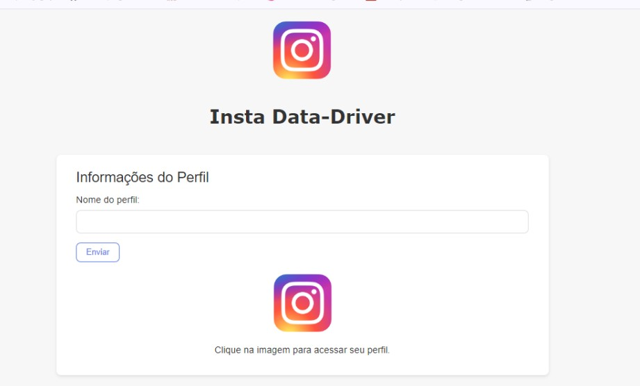

# 📁 Plataforma de Cálculos de Engajamento para Instagram
## 📋 Introdução
Atualmente, muitas empresas e pessoas jurídicas movimentam seu Instagram em prol do crescimento da sua marca, visto que é uma das redes sociais mais utilizadas no mundo. Nela, temos diversos formatos de posts que exploram os formatos de mídia de vídeo e fotos para engajar seguidores e alavancar a imagem das marcas. Além disso, muitas empresas vendem seus produtos pelo próprio Instagram, sendo uma plataforma central para pequenos, médios e grandes empreendedores no alcance de público e conversão de novos clientes.

## 📋 Data-Driven e Instagram
Com o advento das Big Datas e da Ciência de Dados, a Administração de Organizações está cada vez mais baseada em estatísticas para sua tomada de decisão, as chamadas decisões baseadas no modelo **Data Driven**, que utiliza de bancos e análises de dados para o embasamento da tomada de decisões das empresas e empreendedores.

O Instagram, como exemplo, entrega diversos dados para que donos das contas tenham acesso à sua performance nas redes sociais, apesar disso, surge uma problemática: a falta de personalização da análise de dados e dashboards produzidos pela plataforma, o que dificulta a tomada de decisões e o advento de novos modelos estatísticos que supram as necessidades dos donos de contas comerciais.

Pensando nisso, eu, incentivado pelo professor Luan Oliveira (in100tiva), desenvolvi um ambiente de coleta e análise de dados que possa estimular e alavancar a tomada de decisões com base na performance de engajamento do Instagram.

Atualmente essa aplicação Web encontra-se em fase de desenvolvimento, e de protótipo, e você pode ter acesso a algumas funcionalidades:
- Análise de Engajamento Feed;
- Análise de Engajamento Explorar;
- Análise de Engajamento Stories;

## 📋 Conclusão
Essas análises foram tomadas com base no estudo de vídeos sobre o algoritmo de engajamento do Instagram, que analisaram do ponto de vista de um terceiro, como o Instagram calcula o engajamento de suas contas.

Já que o Instagram tem código fechado, os cálculos aqui não chegam nem perto da forma como o Instagram calcula seus dashboards, apesar disso, pelo aspecto subjetivo, conseguimos uma aproximação que produz um resultado que busca ser útil para a tomada de decisões de perfis para aumentar seu engajamento, e com isso, melhorar as métricas de consumo de suas empresas.

# 🔎 Tecnologias
Esse projeto foi desenvolvido com as seguintes tecnologias:
- JavaScript
- DOM (Document Object Model)
- HTML
- CSS
- Github

# 🎨 Layout
Você pode visualizar o projeto através desse [link](https://jeanfar.github.io/Engajamento-Insta/).

# 🧑‍💻 Créditos
Projeto Incentivado por:
Professor Luan Oliveira (in100tiva) [link] (#https://github.com/in100tiva)
- Estilização Luan Oliveira;

